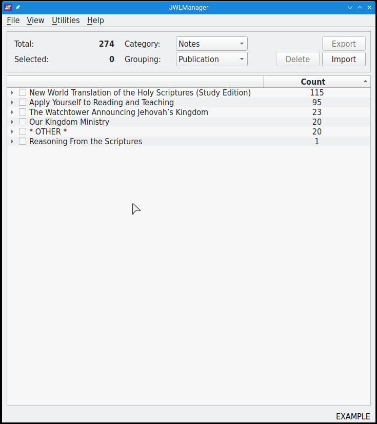

[](https://gitlab.com/erykj/jwlmanager)  
# JWLManager

## Purpose

This is a **multi-platform[^#] and multi-language[^*] application** for viewing and performing various operations on the *user* data (Notes, Highlights, Favorites, Bookmarks, Annotations and Playlists) stored in a *.jwlibrary* backup archive (created from within the **JW Library** app[^1]: Personal Study → Backup and Restore → Create a backup). A modified *.jwlibrary* archive can then be restored within the app.

In addition to the main functions of **viewing, editing, exporting, importing, and deleting**, the application can also clean up any residual/unused records from the database and re-index the various tables within the database. Items from different backups can be **merged** by exporting the desired items (to a MS Excel spreadsheet or a custom text file) and importing them into an existent archive or into a new one.

Keep in mind that the more items there are to be sorted into a tree structure, the longer it will take. Also, *do* keep a backup until you're convinced that all is well ;-)



____
## Usage

You can [download](https://github.com/erykjj/jwlmanager/releases/latest) (unzip if necessary) and launch the latest **Linux binary**, **Windows executable**, or **macOS app**. These are self-contained packages (with Python and dependencies included).

See [here](https://github.com/erykjj/jwlmanager/blob/master/.github/SECURITY.md) for information about **security alerts**, etc. The Linux binary needs to be given execute permissions: `chmod +x JWLManager_*` .

You can launch the GUI in the desired language by appending the corresponding language code parameter. So, if you want to start the app in Spanish (instead of the default English), you would invoke it as...
- Linux terminal: `python3 JWLManager.py -es`
- Windows Comand Prompt (or shortcut): `JWLManager.exe -es`
- macOS Terminal: `open -a JWLManager.app --args -es`
The state of the application (including the current language) is preserved in a `JWLManager.conf` file created in the same directory as the app. You can delete that file to start with default settings.

If you have Python 3 installed on your system and can install some of the required libraries/dependencies[^2], [download](https://github.com/erykjj/jwlmanager/releases/latest) and extract the latest release source code; then execute to run (from inside JWLManager folder):

```
python3 JWLManager.py
```

Or, make it executable first and run directly:

```
chmod +x JWLManager.py
./JWLManager.py
```

If you use the `-h` flag, you'll see the following options:

```
usage: JWLManager.py [-h] [-v] [-de | -en | -es | -fr | -it | -pl | -pt | -ru | -uk]

Manage .jwlibrary backup archives

options:
  -h, --help     show this help message and exit
  -v, --version  show version and exit

interface language:
  English by default

  -de            German (Deutsch)
  -en            English (default)
  -es            Spanish (español)
  -fr            French (français)
  -it            Italian (italiano)
  -pl            Polish (Polski)
  -pt            Portuguese (Português)
  -ru            Russian (Pусский)
  -uk            Ukrainian (українська)
```
____
## Operation

See [here](res/HELP.md) for an explanation of how to use.

____
## Feedback, etc.

Feel free to get in touch and post any [issues](https://github.com/erykjj/jwlmanager/issues) and/or [suggestions](https://github.com/erykjj/jwlmanager/discussions).

[](https://github.com/erykjj/jwlmanager/releases.atom)

My other *JW Library* project: [**JWPubLib**](https://github.com/erykjj/jwpublib)

____
#### Footnotes:
[^#]: Requirements: Linux, MS Windows 10/11, macOS 11 "Big Sur" and newer
[^*]: German needs revision; Chinese and Japanese need to be completed; other languages also welcome: [Weblate](https://hosted.weblate.org/engage/jwlmanager/).
[^1]: [JW Library](https://www.jw.org/en/online-help/jw-library/) is a registered trademark of *Watch Tower Bible and Tract Society of Pennsylvania*.
[^2]: See [`/res/requirements.txt`](https://github.com/erykjj/jwlmanager/blob/master/res/requirements.txt).
